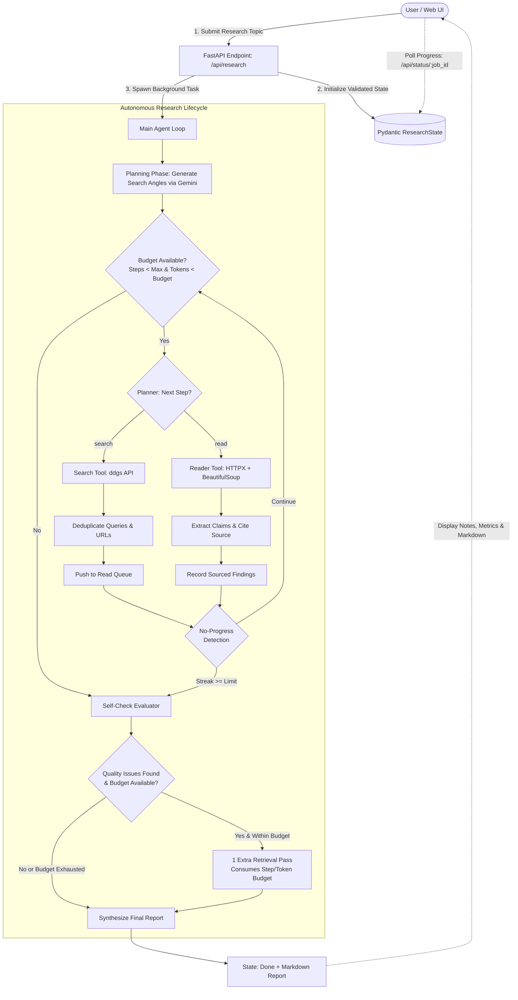

# Autonomous Research Agent 🧠🔍

An intelligent, multi-step autonomous research agent built in **Python** using **FastAPI**, **Google Gemini LLM**, **Pydantic**, **HTTPX + BeautifulSoup**, and a modern **React + Vite** frontend.

The agent plans research angles, explores the web within strict bounded step and token budgets, extracts verifiable claims with source citations, prevents duplicate queries and no-progress loops, performs a self-check evaluation pass (strictly within budget), and synthesizes a comprehensive final report.

---

## 🛠️ Technology Stack

| Component | Technology | Description |
| :--- | :--- | :--- |
| **Language** | Python 3.13 | High-performance modern backend language |
| **LLM** | OpenAI-Compatible (`gemini-pro`) | Custom endpoint (`https://ai-service-by-nik6348.vercel.app/v1/`) with offline fallback |

| **Web Search** | Search API (`ddgs` / DuckDuckGo) | Querying live web sources without rate limits |
| **Web Reading** | `HTTPX` + `BeautifulSoup` | HTTP client with HTML parsing and clean article body extraction |
| **State** | Pydantic Models (`ResearchState`) | Strongly-typed, validated state machine |
| **Validation** | Pydantic v2 | Request/response and schema validation |
| **Backend** | FastAPI + Uvicorn | Asynchronous REST API with background task execution |
| **Configuration** | `.env` (`pydantic-settings`) | Type-safe environment variable management |
| **Testing** | `pytest` | 16 comprehensive unit & integration tests |
| **Logging** | Python `logging` | Standard structured logging + live UI streaming |
| **Frontend** | React 19 + TypeScript + Tailwind CSS | Real-time progress tracker, notes display, and report exporter |

---

## 🏗️ Architecture & Execution Flow



---

## 📋 Project Checklist

- [x] **User research topic**: Validated topic input with length/whitespace checks (`ResearchRequest`).
- [x] **Initial planning**: Generates targeted query angles via Gemini LLM (with heuristic fallback).
- [x] **Multiple research steps**: Bounded iterations across search and reading actions.
- [x] **Search tool**: Searches the web and extracts title, URL, and body snippet.
- [x] **Read tool**: HTTPX + BeautifulSoup extraction with HTML boilerplate filtering.
- [x] **Explicit research state**: Pydantic `ResearchState` tracking steps, queue, tokens, findings, logs.
- [x] **Next-step selection**: Dynamic `planner()` choosing `search`, `read`, or `report`.
- [x] **Findings extraction**: Claims paired with source URL, snippet context, and confidence score.
- [x] **Source records**: `SourceRecord` models with timestamps and URLs.
- [x] **Maximum steps**: Strict enforcement (`max_steps = 8`).
- [x] **Token/cost budget**: Tracks `tokens_used`, `token_budget` (12,000 tokens), and `estimated_cost_usd`.
- [x] **Duplicate query prevention**: Query deduplication set and visited URL registry.
- [x] **No-progress detection**: Early exit when finding count stalls over consecutive iterations.
- [x] **Final evaluator**: Evaluates source validity and finding count.
- [x] **Evaluator can request one extra retrieval**: Granted if quality issues are found.
- [x] **Extra retrieval also respects budget**: **STRICTLY enforced** (`steps_used < max_steps` and `tokens_used < token_budget`).
- [x] **Structured final report**: Markdown format containing Executive Summary, Key Sourced Findings, Budget Transparency, Conclusion, and References.
- [x] **Graceful failure**: Network, API, or parsing errors caught without crashing server.
- [x] **Logs**: Standard Python `logging` module with console format + frontend event stream.
- [x] **README**: Full system documentation with setup and architecture.
- [x] **Architecture/flow diagram**: Mermaid diagram detailing decision branches.

---

## 🚀 Getting Started

### 1. Backend Setup

```bash
cd backend

# Create / activate virtual environment (if not already active)
python3 -m venv .venv
source .venv/bin/activate

# Install dependencies
pip install -r requirements.txt

cp .env.example .env
# Edit .env and paste your API key:
# AI_BASE_URL=https://ai-service-by-nik6348.vercel.app/v1/
# AI_MODEL=gemini-pro
# API_KEY=your_actual_key_here
```


### 2. Run Backend API Server

```bash
# Start FastAPI backend on port 5001
python main.py
# Or using uvicorn directly:
uvicorn main:app --host 127.0.0.1 --port 5001 --reload
```
- API Docs (Swagger UI): **http://127.0.0.1:5001/docs**
- Health Check: **http://127.0.0.1:5001/api/health**

---

### 3. Frontend Setup

In a separate terminal:

```bash
cd frontend

# Install npm packages
npm install

# Start development server
npm run dev
```
Open **http://localhost:5173** in your browser.

---

## 🧪 Running Automated Tests

Run the test suite using `pytest`:

```bash
cd backend
./.venv/bin/pytest tests -v
```

### Test Coverage Highlights:
- `test_models.py`: Validates Pydantic schemas, whitespace cleaning, budget checking logic.
- `test_tools.py`: Tests `search_web` and `read_page` HTML tag decomposition and graceful failure.
- `test_agent.py`: Tests next-step planning, duplicate prevention, no-progress breaks, and verifies that the **evaluator extra retrieval strictly respects the budget**.
- `test_api.py`: Tests FastAPI health, job submission validation, and status retrieval.

---

## 📡 API Endpoints Reference

### `POST /api/research`
Initiates an autonomous research job.
```json
{
  "topic": "Future of artificial intelligence in medicine"
}
```
**Response (201 Created):**
```json
{
  "job_id": "a1b2c3d4",
  "message": "Research started successfully"
}
```

### `GET /api/status/{job_id}`
Polls progress, logs, tokens, findings, and the final report.
```json
{
  "job_id": "a1b2c3d4",
  "status": "done",
  "steps_used": 6,
  "max_steps": 8,
  "tokens_used": 3410,
  "token_budget": 12000,
  "estimated_cost_usd": 0.00051,
  "findings": [
    {
      "claim": "AI models enhance medical imaging accuracy.",
      "source": "https://example.com/article"
    }
  ],
  "logs": [
    "Starting autonomous research on topic: '...'",
    "Step 1: Web Search -> ..."
  ],
  "report": "# Research Report: ...\n\n## Key Findings\n..."
}
```

### `GET /api/health`
Health check verifying server availability.
```json
{
  "ok": true,
  "service": "Autonomous Research Agent API",
  "status": "online"
}
```
